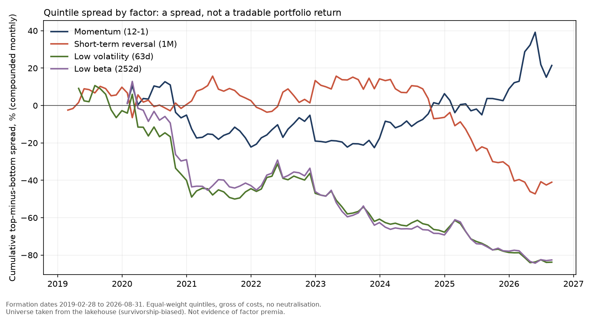
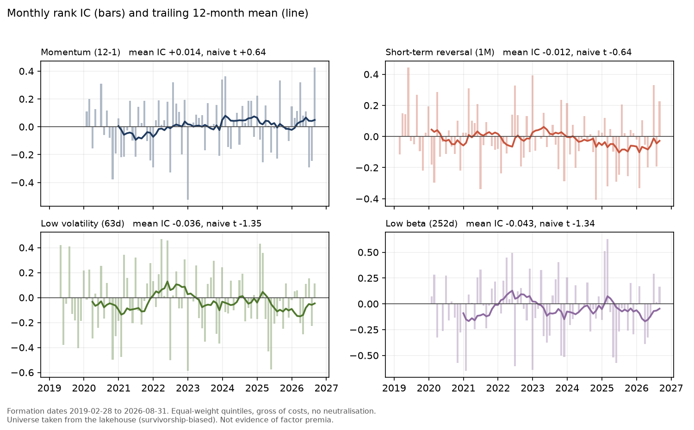

# factor-mart

[](https://github.com/narasimhamungi/factor-mart/actions/workflows/ci.yml)

Cross-sectional equity factor mart: portable SQL models that run unchanged on DuckDB and Snowflake,
an input data contract, post-run invariants, and a DuckDB-vs-Snowflake parity check. Power BI sits on
top (not built yet). The point is the engineering - **not** a claim that any factor earns excess return.

## Verification status (as of 2026-10-01)
| Claim | Status |
|---|---|
| SQL logic correct | **Demonstrated** - 25 tests on DuckDB: exact beta recovery on noise-free factor data, momentum/reversal vs a pandas reference, zero vol for constant returns, gap handling, perfect +/-1 IC and monotone quintiles on constructed data, injected-duplicate detection, parity-checker self-tests |
| Pipeline runs on real data | **Demonstrated** - lakehouse consensus prices: 957,361 rows, 503 tickers after de-duplication; all post-run checks pass |
| Pipeline runs on Snowflake | **Demonstrated** - full run on a Snowflake trial account, key-pair authentication, all checks pass |
| DuckDB and Snowflake agree | **Demonstrated** - `python -m factor_mart.parity`: identical row counts on all 11 tables, 0 quintile disagreements across 169,289 rows, max score difference 8e-15, summary statistics equal to float precision. The check found one real engine difference (Snowflake's `AVG` over decimal literals rounds to 6 places, off by 4.8e-7 on `hit_rate`); fixed by casting to DOUBLE |
| CI | **Demonstrated** - GitHub Actions runs the DuckDB test suite on Python 3.12 and 3.14 for every push (badge above). The Snowflake load and the parity check need credentials and are run manually |
| Results reproducible without a warehouse | **Demonstrated** - `results/` holds the four mart tables as CSV plus a manifest; `python -m factor_mart.report` regenerates the CSVs and charts |
| Power BI model / DAX | **Not built.** `powerbi/` holds the DAX and model spec only; its reconciliation page is the planned test |
| Factor performance is investable | **No.** See Results and Known limitations |

## What was built
| Layer | Content |
|---|---|
| Contract | `contract.py` - aborts on missing columns, nulls, non-positive prices, duplicate (ticker, date); duplicates collapse only within a stated price tolerance (`--dup-tol`), anything larger aborts |
| Models | `src/factor_mart/sql/00-06` - returns -> market proxy -> rolling signals -> z-scores -> forward returns -> marts |
| Checks | `checks.py` - duplicates, winsor band, quintile balance, top>bottom ordering, factor coverage; warnings for >80% monthly moves and for thin effective history |
| Backends | DuckDB (tests/offline) and Snowflake - **same SQL files**, limited to constructs both engines accept |
| Parity | `parity.py` - row counts, summary statistics and row-level scores/quintiles compared across the two engines |
| Reporting | `report.py` - exports the marts to `results/` (CSV, charts, manifest) so the README does not depend on a live Snowflake account |
| BI | `powerbi/` - DAX measures, model spec, theme (unbuilt) |

## Input data (marketdata-lakehouse)
Source: `fact_price_daily_consensus` joined to `dim_security` (ticker) and `dim_date` (date); query in
`queries/lakehouse_consensus.sql`. Observed in the author's lakehouse on 2026-10-01 (counts will drift):
- 957k rows after de-duplication, 503 tickers. Raw date range 2009-2026, but **most tickers start in 2019**,
  so the scored window is 2019-02 to 2026-09 (80 monthly observations for momentum/beta, 89-91 for vol/reversal).
- `dim_security` is slowly-changing. Six tickers (AAPL, AMZN, MSFT, ZBH, ZBRA, ZTS) carry more than one
  `security_key`, producing 11,580 duplicate (ticker, date) rows. Prices differ only at float-rounding
  level (relative spread ~1e-7); `--dup-tol 1e-5` collapses a duplicate group only within that tolerance
  and aborts on anything larger. The root cause (duplicate keys) sits in the lakehouse `dim_security` load
  and is not fixed here.

## Methodology (as implemented)
- Daily return = adj_close / previous adj_close - 1; NULL (never bridged) if the gap exceeds 5 calendar days.
- Market proxy = equal-weight universe mean return (includes the stock itself).
- Signals: 12-1 momentum (t-252 to t-21 rows), 21-row reversal, 63-obs annualised vol, 252-obs beta. Windows must be complete and calendar-sane or the value is NULL.
- Rolling statistics use SUM/COUNT window sums rather than STDDEV/COVAR window functions, for portability.
- Month-end rebalance (last market date in month); z-score per factor-month, winsorised at +/-3, multiplied by direction so higher = better; NTILE(5); L/S = Q5 - Q1 equal-weight, earned over the following month.
- IC = rank correlation of score vs forward return. Annualisation = mean x 12 and stdev x sqrt(12) (arithmetic simplification).

## Results (provisional - read the limitations first)
Real lakehouse data, 2019-02 to 2026-09, run of 2026-10-01. L/S = top minus bottom quintile, gross of costs.

| Factor | Months | Ann. L/S return | Ann. L/S vol | L/S Sharpe | Hit rate | Mean IC | ICIR | t (L/S)* | t (IC)* |
|---|---|---|---|---|---|---|---|---|---|
| Momentum 12-1 | 80 | +4.4% | 17.4% | 0.25 | 53.8% | +0.014 | 0.07 | 0.66 | 0.64 |
| Reversal 1M | 91 | -5.7% | 15.6% | -0.37 | 41.8% | -0.012 | -0.07 | -1.01 | -0.64 |
| Low volatility 63d | 89 | -21.6% | 22.8% | -0.95 | 37.1% | -0.036 | -0.14 | -2.58 | -1.35 |
| Low beta 252d | 80 | -22.7% | 25.2% | -0.90 | 38.8% | -0.043 | -0.15 | -2.32 | -1.34 |

\*Naive t-statistics derived from the table: t(L/S) = Sharpe x sqrt(months/12), t(IC) = ICIR x sqrt(months); no
adjustment for autocorrelation or multiple testing.





The numbers above and the charts come from the snapshot in [`results/`](results/) (see `results/MANIFEST.txt`).

What this does and does not show:
- Momentum and reversal are statistically indistinguishable from zero (|t| about 1 or less). No factor's mean IC is distinguishable from zero (|t| < 1.4).
- The low-volatility and low-beta quintile spreads are negative with naive |t| of 2.3-2.6 over 80-89 months. Inference, not tested here: consistent with high-beta/growth leadership and the 2020 rebound in this window; there is no sector or size neutralisation to separate those effects.
- None of this is evidence about factor premia in general (see limitations).

## Known limitations (state these in interviews before a reviewer does)
- **Survivorship and look-ahead bias:** the scored universe is today's constituent list back-filled. Evidence from this run: PLTR has forward returns from the 2020-10-30 formation date and SMCI from 2023-04-28, but the index added them in September 2024 and March 2024 (index-join dates are from the public record, not verified in this repo). Names that left the index and delisted names are absent, and names are included before they qualified, so spreads here are not what an investor could have earned.
- Short sample: 80-91 monthly observations per factor; Sharpe ratios carry wide error bars.
- Equal-weight proxy includes the stock; with 500 names the bias is small, with 20 it is not.
- Gross of costs, no turnover, no sector/size neutralisation, no liquidity filter.
- `adj_close` quality is inherited from the lakehouse; the >80% warning is a tripwire, not a guarantee (the 23 flagged ticker-months look like real market events but were not individually verified against an external source).
- Row-offset windows (21/252 rows) assume mostly complete daily history; calendar-span gates NULL out signals when they do not hold.

## Run
```powershell
python -m venv .venv
.\.venv\Scripts\Activate.ps1
python -m pip install -e ".[dev,snowflake,postgres]"
python -m pytest
# lakehouse (Postgres) -> DuckDB, no warehouse credits:
$env:PGURL = "postgresql+psycopg2://<user>:<password>@127.0.0.1:5432/marketdata_lakehouse"
python -m factor_mart run --backend duckdb --postgres-url $env:PGURL --query-file queries\lakehouse_consensus.sql --dup-tol 1e-5 --min-universe 30
# Snowflake: run snowflake\00_setup.sql once in Snowsight, copy .env.example to .env (key-pair auth), then
python -m factor_mart run --backend snowflake --postgres-url $env:PGURL --query-file queries\lakehouse_consensus.sql --dup-tol 1e-5 --min-universe 30
python -m factor_mart.parity      # DuckDB vs Snowflake: must end in PARITY OK
python -m factor_mart.report      # results/ : CSV snapshot, two charts, manifest
```
Input must expose `ticker, trade_date, adj_close`; alias columns in the query file if your table differs.

## Power BI
Not built yet. `powerbi/MODEL.md` describes the model, relationships and report pages; `powerbi/measures.dax`
holds the measures. The planned reconciliation page compares DAX output with `mart_factor_summary`.

## Related projects
- [marketdata-lakehouse](https://github.com/narasimhamungi/marketdata-lakehouse) - the multi-source price warehouse this reads from.
- [snowflake-bi-lab](https://github.com/narasimhamungi/snowflake-bi-lab) - loads the same gold layer into Snowflake with a data-quality suite and a Power BI report.

## License
MIT - see [LICENSE](LICENSE).

## Employer takeaway
Modelled warehouse layers with explicit contracts and invariants, engine-portable SQL verified by a
cross-engine parity check (which caught a real Snowflake decimal-rounding difference), and results reported
with their statistical and survivorship caveats rather than as alpha.
